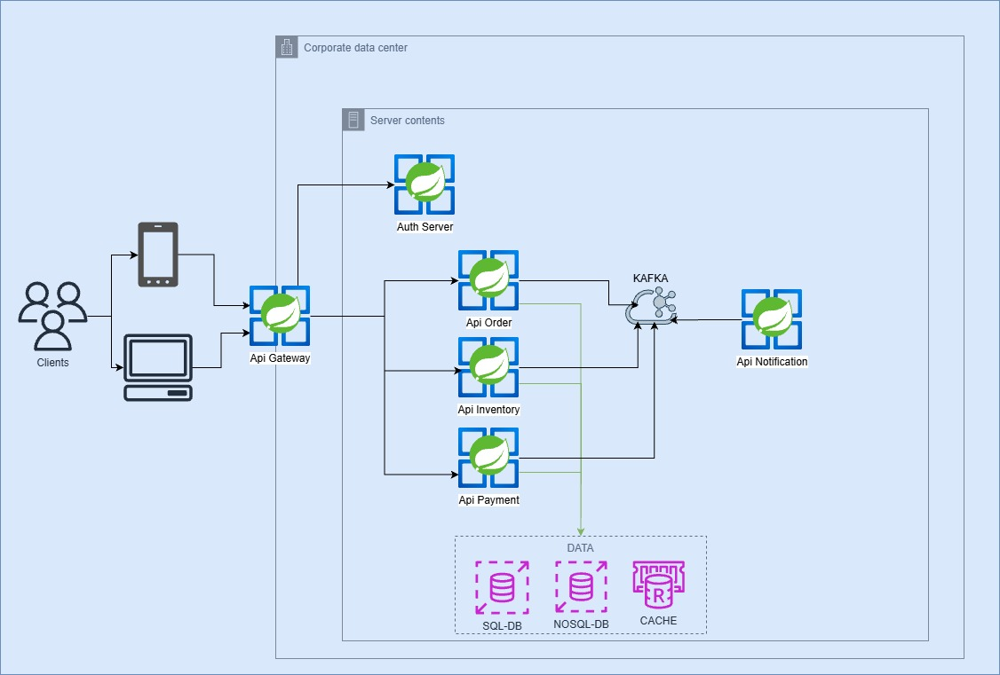
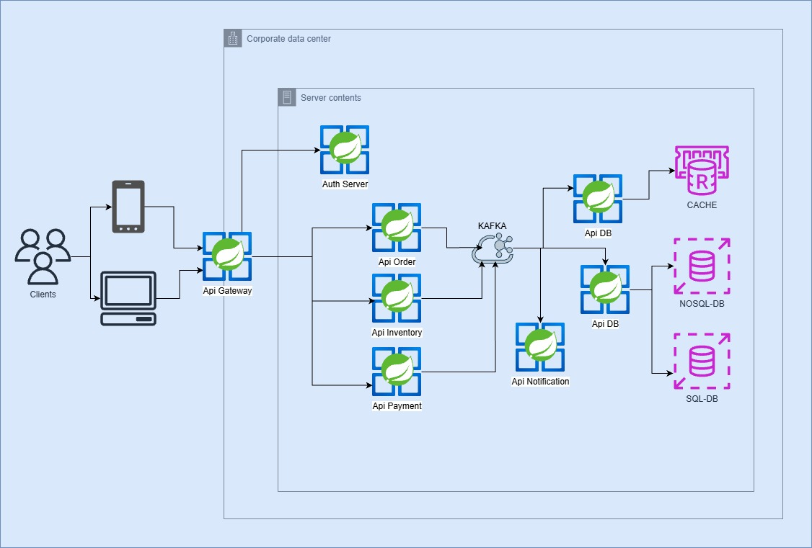
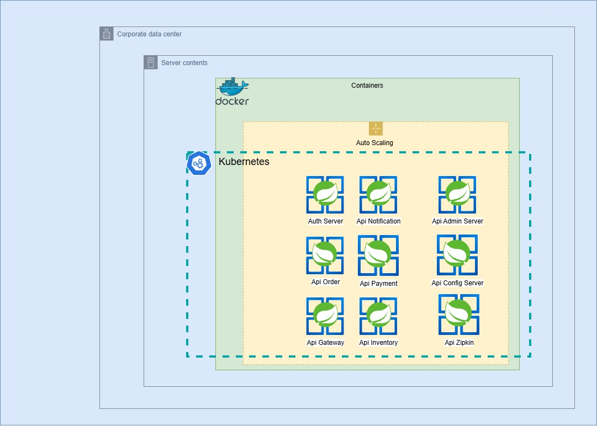

# Plantilla de Referencia (blueprint)
Se inicia este proyecto con la ayuda de las IA de **Google Gemini** y **Copilot**, con el fin de crear una plantilla que se puede replicar en cualquier **sector financiero o de retail masivo**,
 para crear una **Arquitectura Limpia** con los siguientes pilares. 

1. Escalabilidad y Fiabilidad 
2. Resiliencia y Eficiencia 
3. Seguridad 
4. Optimización de costos 
5. Buenas practicas

La meta es aplicar las mejores prácticas en arquitectura y desarrollo con una metodología **[DevSecOps](https://aws.amazon.com/es/what-is/devsecops/)**, será un proyecto colaborativo, donde a medida que se avanza, espero poder contar con la ayuda de personas que tenga conocimiento y/o experiencia en el ámbito que yo no pueda cubrir. 

## Arquitectura Global
En este apartado voy a plantear diferentes ideas de arquitecturas en función del flujo de la información, manejando microservicios y las técnicas que me he encontrado en las diferentes empresas donde he tenido la oportunidad de colaborar.

> Flujo en el que cada microservicio interactúa con su propia base de datos y publica en **KAFKA**, para que los subscritos al evento inicien sus flujos.  
Este es un flujo tradicional en el cual se incluye **KAFKA** para que no exista acoplamiento entre los micros.  

> Flujo en el que desde el **gateway** se lanza una **orden** por el cliente, esta **orden** publica el evento en **kafka** y los que estén subscritos a ese evento podrán iniciar sus tareas.

> Flujo en el que desde el **gateway** se llama a una de las **Apis** y estas lanzan eventos a **kafka** para que los subscritos actúen en consecuencia. `Idea pendiente de validar`

## Orquestación

# Estructura de la Solución
Para que el proyecto sea robusto, sugiero que no sea un monolito, sino un ecosistema de microservicios que interactúen así:

1. **API Gateway:** Punto de entrada único (Spring Cloud Gateway) con seguridad integrada.
2. **Servicio de Catálogo/Inventario:** Usando Spring WebFlux y una base de datos NoSQL (ej. MongoDB) para alta disponibilidad de lectura.
3. **Servicio de Órdenes:** El corazón de la asincronía. Recibe pedidos y los publica en Kafka.
4. **Servicio de Pagos/Notificaciones:** Consumidores de Kafka que procesan tareas pesadas sin bloquear al usuario.

# Stack Tecnológico y Mejores Prácticas
Se define la idea inicial la cual puede cambiar antes de crear el primer proyecto.

|Categoría|Herramientas Sugeridas|¿Por qué?
|---------|----------------------|------
|Desarrollo Asíncrono|Spring Boot 3 + WebFlux + R2DBC|WebFlux es excelente, pero para que sea 100% no bloqueante, la conexión a la DB también debe serlo (R2DBC).
|Mensajería|Confluent Kafka|Implementar patrones como Event Sourcing o CQRS para manejar grandes volúmenes.
|Seguridad de Código|SonarQube + Snyk|Fortify es potente, pero Snyk es más moderno para analizar vulnerabilidades en dependencias y contenedores (SCA).
|DevOps / CI-CD|GitHub Actions|Para proyectos modernos, su integración con el repositorio es superior a Jenkins en agilidad y mantenimiento de "Pipelines as Code".
|Infraestructura|Docker + Kubernetes (K8s)|Si ya conoces OpenShift, K8s puro te dará la base para entender cualquier nube (AWS EKS, Azure AKS).
|Observabilidad|Prometheus + Grafana + ELK|No basta con logs; necesitamos métricas (Prometheus) y trazabilidad distribuida (Jaeger o Zipkin) para ver el viaje de una petición entre microservicios.

## ELK Stack (Logs y Búsqueda)
**ELK** es el acrónimo de tres herramientas de código abierto que trabajan juntas:
1. **Elasticsearch:** Un motor de búsqueda y analítica (donde se guarda la data).
2. **Logstash:** El procesador que recibe, transforma y envía los logs.
3. **Kibana:** La interfaz gráfica (dashboards) para visualizar esos logs.

> **¿Por qué ELK?** Es el estándar de la industria. Su capacidad para indexar grandes volúmenes de texto y permitir búsquedas casi instantáneas en millones de líneas de logs es inigualable.

### Otras opciones (Alternativas a ELK):

1. **EFK (Elasticsearch, Fluentd, Kibana):** Es casi igual, pero cambia Logstash por Fluentd. Es la opción preferida en entornos de Kubernetes porque consume menos memoria.
2. **Loki (de Grafana Labs):** Es la alternativa moderna. A diferencia de ELK, Loki no indexa todo el contenido del log, sino solo las etiquetas (metadata). Esto lo hace mucho más barato y ligero de mantener. Si quieres algo muy "Cloud Native", Loki es el fuerte competidor actual.

## Prometheus (Métricas y Alertas)
Mientras ELK se encarga de los Logs (eventos específicos: `El usuario X compró el item Y`), Prometheus se encarga de las Métricas (números y estados: `¿Cuánta CPU consume el servicio?`, `¿Cuántas peticiones por segundo hay?`).

**¿Por qué Prometheus?**

1. **Modelo Pull:** Él le `pregunta` a tus microservicios su estado cada X segundos, lo que evita que el microservicio se sobrecargue enviando data.
2. **Integración nativa con K8s:** Kubernetes y Prometheus hablan el mismo idioma.
3. **PromQL:** Un lenguaje de consultas muy potente para generar alertas complejas.

## Comparativa
Dado que se quiere una arquitectura robusta pero eficiente, yo usaría **Prometheus + Loki + Grafana**. 
¿Por qué? Porque con Grafana puedes ver tanto tus métricas (Prometheus) como tus logs (Loki) en un mismo panel, sin tener que saltar entre Kibana y otra herramienta.

|Necesidad			       |Herramienta Líder			       |Alternativa `Moderna/Ligera`
|-                  |-                          |-
|Logs (Texto)		     |ELK (Potente, pesado)      |Loki (Ligero, integrado con Grafana)
|Métricas (Números)	|Prometheus (Estándar K8s) 	|VictoriaMetrics (Alto rendimiento)
|Visualización		    |Kibana (Solo para ELK)    	|Grafana (Visualiza Logs, Métricas y Trazas)

# Puntos Extra
Para que el proyecto sea **blindado** y digno de un Arquitecto de Sistemas senior, deberíamos incluir:

1. **Resilience4j:** Implementar patrones de Circuit Breaker y Retry. Si el servicio de pagos falla, la tienda no debe morir.
2. **Secret Management:** No hardcodear credenciales. Usar HashiCorp Vault o los Secrets de K8s.
3. **Infrastructure as Code (IaC):** Usar Terraform para crear tu cluster de Kubernetes. Es mejor que crearlo manualmente.
4. **Pruebas de Carga:** Usar k6 o JMeter para demostrar que tu arquitectura realmente aguanta el volumen de datos que planeas.

## Versiones del Stack Tecnológico

### 1. Lenguaje y Framework Base
| Componente | Versión | Motivo / Nota |
| :--- | :--- | :--- |
| **Java JDK** | 21 (LTS) | Uso de Virtual Threads y Records para DTOs. |
| **Spring Boot** | 3.2.x | Soporte nativo para Jakarta EE y Project Reactor. |
| **Maven** | 3.9+ | Gestión de dependencias con Maven Central. |
| **Project Reactor** | Latest | Core de programación reactiva (Mono/Flux). |

### 2. Infraestructura y Orquestación
| Componente | Versión | Rol en el Proyecto |
| :--- | :--- | :--- |
| **Kubernetes** | 1.28+ | Orquestación de microservicios (Kind/Minikube). |
| **Docker** | 24.0+ | Contenerización de aplicaciones y servicios. |
| **Helm** | 3.13+ | Manejo de despliegues y plantillas de K8s. |
| **Terraform** | 1.6+ | (Opcional inicial) Para definir la infraestructura como código (IaC). |

### 3. Persistencia y Mensajería (Event-Driven)
| Componente | Versión | Implementación |
| :--- | :--- | :--- |
| **Apache Kafka** | 3.6 (KRaft) | Bus de eventos asíncronos (sin Zookeeper). |
| **Redis** | 7.2 | Caché y reserva de stock con TTL. |
| **PostgreSQL** | 16.1 | DB relacional con driver R2DBC. |
| **MongoDB** | 7.0 | NoSQL para catálogo de productos. |

### 4. Calidad y Seguridad (DevSecOps)
| Componente | Versión | Función |
| :--- | :--- | :--- |
| **SonarQube** | Latest (LTS) | Análisis estático de código (SAST). |
| **Snyk** | CLI / Action | Escaneo de vulnerabilidades (SCA). |
| **GitHub Actions** | N/A | Automatización de flujos de CI/CD. |
| **Checkstyle** | Latest | Estándares de escritura de código. |

### 5. Observabilidad (Telemetría)
| Componente | Versión | Tipo de Dato |
| :--- | :--- | :--- |
| **Prometheus** | Latest | Métricas de rendimiento y salud. |
| **Grafana** | 10.2+ | Visualización y Dashboards. |
| **Loki** | 2.9 | Centralización de Logs. |
| **Tempo** | Latest | Tracing distribuido (ID de correlación). |

# Análisis de la Arquitectura
Para que sea realmente escalable y resiliente, el flujo se organiza así:

1. **Capa de Entrada `(Edge)`:**
    1. **Spring Cloud Gateway:** Maneja el enrutamiento, seguridad (OAuth2/JWT) y Rate Limiting.

2. **Capa de Negocio `(Reactive Core)`:**
   1. **Microservicios con WebFlux:** Cada servicio es independiente y maneja su propia base de datos `(Database per Service)`.

   2. **R2DBC / Drivers Reactivos:** Fundamental para no bloquear hilos de ejecución en las consultas a DB.

3. **Capa de Eventos `(Event-Driven)`:**
   1. **Kafka:** Actúa como el sistema de mensajería asíncrona. Por ejemplo, cuando se crea una orden, el servicio de órdenes publica un evento y el servicio de `inventario, pagos y notificaciones` lo consumen de forma independiente.

4. **Seguridad y Resiliencia:** Para que sea una arquitectura **top**, incluiremos en el diseño:
   1. **Circuit Breaker (Resilience4j):** Si Kafka llegara a tener un retraso o un microservicio falla, el sistema debe responder con un fallback o una respuesta degradada en lugar de colapsar.
   2. **Config Maps & Secrets:** Gestión de variables de entorno de forma segura dentro de tu cluster.

6. **Patrón de desarrollo:**

7. **Metodología de desarrollo:**

# Capa de Soporte 
> Observabilidad y Calidad
1. **Sidecars/Agents:** En Kubernetes, incluiremos agentes para enviar `logs a ELK` y `métricas a Prometheus`.
2. **Pipeline de CI/CD:** Aquí es donde integramos `SonarQube y Snyk` para que cada commit sea analizado antes de llegar a los pods.

